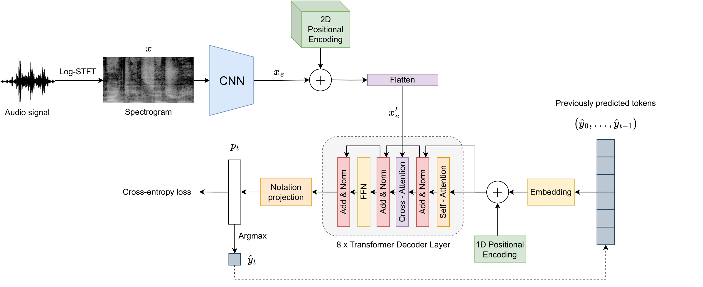
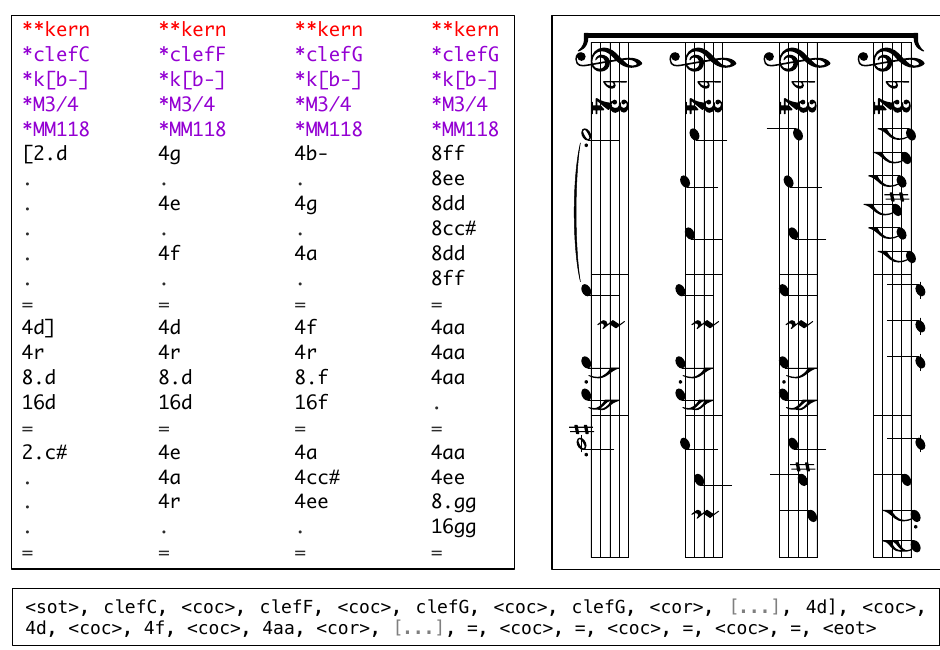

# A Transformer Approach for Polyphonic Audio-to-Score Transcription

**María Alfaro-Contreras, Antonio Ríos-Vila, Jose J. Valero-Mas, Jorge Calvo-Zaragoza**

Pattern Recognition and Artificial Intelligence Group, University of Alicante, Spain  
{malfaro, arios, jjvalero, jcalvo}@dlsi.ua.es

**Publication:** ICASSP 2024 — 2024 IEEE International Conference on Acoustics, Speech and Signal Processing.  
**DOI:** [10.1109/ICASSP48485.2024.10447162](https://doi.org/10.1109/ICASSP48485.2024.10447162)

## Abstract

End-to-end Audio-to-Score (A2S) transcription aims to derive a score that represents the music content of an audio recording in a single step. While current state-of-the-art methods, which rely on Convolutional Recurrent Neural Networks trained with the Connectionist Temporal Classification loss function, have shown promising results under constrained circumstances, these approaches still exhibit fundamental limitations, especially when dealing with complex sequence modeling tasks, such as polyphonic music. To address these conditions, this work introduces an alternative learning scheme based on a Transformer decoder, specifically tailored for A2S by incorporating a two-dimensional positional encoding to preserve frequency-time relationships when processing the audio signal. The results obtained over three datasets of polyphonic string music confirm the adequacy of the method, which improves the transcription rate by an average of 44% compared to previous approaches.

## Index Terms

Audio-to-score transcription, Deep neural networks, Transformers.

## 1. INTRODUCTION

Audio-to-Score (A2S) transcription aims to obtain a score-level symbolic representation, commonly referred to as (music) transcription, of the musical content embedded in an audio file [1]. Early A2S research works (e.g., [2, 3, 4]) mainly relied on multi-step pipelines to mitigate the complexity of the task. In these frameworks, each stage estimated the individual aspects of the transcription (such as notes, key and time signatures, streams, bars, or voices) that were eventually integrated. However, issues related to error propagation between the stages, as well as the suitability of A2S methods for specific scenarios based on particular heuristics, have impeded their practical application. By contrast, advances in Deep Learning have enabled the development of neural holistic (or end-to-end) A2S methods that perform the transcription process in a single step, thereby alleviating the aforementioned problems [5, 6, 7, 8, 9].

The state-of-the-art end-to-end A2S approach is grounded in an encoder-decoder paradigm. The encoder, typically a Convolutional Neural Network (CNN), extracts relevant features from the input audio spectrogram. These features are then interpreted as sequences of musical symbols by the decoder, which is often implemented as a Recurrent Neural Network (RNN). Although differences in architecture design in the existing literature predominantly revolve around hyperparameter tuning (e.g., the number of layers), those in the training strategy pertain to the formulation of the sequence labeling task. There are two main approaches: (i) using a sequence-to-sequence approach, in which the decoder is trained to predict the next musical symbol in the sequence, given the previous predicted symbols and the encoder output [8]; and (ii) using the Connectionist Temporal Classification (CTC) loss function [10], in which the decoder is trained to predict a sequence of musical symbols without any explicit alignment to the input audio [5, 6, 7, 9, 11].

In this work, we present an approach based on a Transformer [12] for the A2S task. We depart from the conventional decoder design by employing the Transformer architecture, which has emerged as the cutting-edge choice in various domains—originally making its mark in natural language processing, yet subsequently permeating diverse fields. To the best of our knowledge, this work constitutes the first Transformer proposal for A2S that outperforms the current state of the art. We achieve this by incorporating several mechanisms tailored for A2S, such as a two-dimensional position encoding that preserves frequency-time relations. Our results demonstrate that the proposed approach improves the transcription rate by an average of 45% compared to previous methods.

The contributions of this paper are the following: (i) introducing the first competitive Transformer for A2S, (ii) conducting extensive experimentation to quantitatively evaluate the approach using three datasets of polyphonic string music, and (iii) demonstrating a remarkable improvement in the transcription figures compared to existing approaches.

## 2. METHODOLOGY

We propose an end-to-end sequence-to-sequence approach to retrieve the corresponding score transcription of a given audio recording. Our model consists of two fundamental components: an encoder and a decoder. The encoder extracts relevant features from the input spectrogram $x$ and transforms them into a compact feature vector $x'_e$. This vector serves as contextual information to the decoder, which iteratively generates the corresponding transcription

$$
\hat{y} = (\hat{y}_1, \hat{y}_2, \ldots, \hat{y}_{|\hat{y}|}) \in \Sigma^*,
$$

where $\Sigma$ represent the symbol vocabulary used for encoding the music content. An overview of our approach is shown in Fig. 1.

**Figure 1.** Graphical scheme of the encoder-decoder proposal. The encoder is implemented as a CNN, whose output is added to a two-dimensional positional encoding before feeding the decoder, implemented as an auto-regressive Transformer.

### 2.1. Learning framework

#### 2.1.1. Encoder

Let $x \in \mathbb{R}^{f \times t \times 1}$ represent the input magnitude spectrogram of a monaural audio recording, where $f$ and $t$ respectively denote the frequency bins and temporal frames. To process this input, we employ a CNN as the encoder, resulting in the generation of $c_e$ two-dimensional feature maps denoted by $x_e \in \mathbb{R}^{f_e \times t_e \times c_e}$. Note that, $f_e$ and $t_e$ respectively relate to the input’s frequency and temporal dimensions as

$$
f_e = \frac{f}{r_f}
\qquad\text{and}\qquad
t_e = \frac{t}{r_t},
$$

where $r_f$ and $r_t$ represent the corresponding downscaling factors of the CNN block.

As aforementioned, the two-dimensional feature maps serve as contextual vectors for the decoder while iteratively predicting the corresponding music transcription sequence. In this work, we opt for a Transformer [12] decoder as it currently represents the state-of-the-art method for tasks involving conditional sequence prediction of varying lengths due to its capabilities to capture temporal relationships within the data through multi-head attention mechanisms.

It is important to note, however, that the Transformer architecture is inherently designed for one-dimensional sequences such as natural language. Therefore, the two-dimensional feature maps must be converted into a one-dimensional format that is suitable for the input of the Transformer, being a straightforward approach to unfold or flatten them across frequency and time, resulting in sequences of length $f_e \times t_e$.

The Transformer uses a positional encoding (PE) mechanism to model its otherwise order-agnostic operation. This mechanism adds a position vector to each input element, determined by its location in the sequence. Initially, one might consider adding the original one-dimensional PE to the unfolded feature maps: while this may be sufficient for monophonic music, it would result in a loss of spatial information when targeting polyphonic music, where multiple voices (frequencies) impact at the same time. Therefore, to ensure that the model is aware of all dimensions of the spectrogram, we incorporate a two-dimensional PE within the feature maps before they are flattened into a one-dimensional sequence. The two-dimensional PE proposal is based on sine and cosine functions, akin to the original one-dimensional PE, in which the first half of feature dimensions—i.e., $[0, c_e/2)$—is meant for horizontal positions (time), whereas the second half—i.e., $[c_e/2, c_e)$—is used for the vertical positions (frequency), similarly to [13]. Eq. 1 describes this encoding:

$$
\begin{aligned}
\operatorname{PE}_{2D}(\operatorname{pos}_t, 2i)
  &= \sin\left(\frac{\operatorname{pos}_t}{10000^{2i/c_e}}\right) \\
\operatorname{PE}_{2D}(\operatorname{pos}_t, 2i+1)
  &= \cos\left(\frac{\operatorname{pos}_t}{10000^{2i/c_e}}\right) \\
\operatorname{PE}_{2D}\left(\operatorname{pos}_f, \frac{c_e}{2}+2i\right)
  &= \sin\left(\frac{\operatorname{pos}_f}{10000^{2i/c_e}}\right) \\
\operatorname{PE}_{2D}\left(\operatorname{pos}_f, \frac{c_e}{2}+2i+1\right)
  &= \cos\left(\frac{\operatorname{pos}_f}{10000^{2i/c_e}}\right).
\end{aligned}
\tag{1}
$$

where $\operatorname{pos}_t$ and $\operatorname{pos}_f$ respectively specify the horizontal (time) and vertical (frequency) positions and $i \in [0, c_e/4)$ denotes the feature dimension of the PE.

In short, the two-dimensional PE are added to the extracted feature maps ($x_e$) and then unfolded into a one-dimensional sequence,

$$
x'_e \in \mathbb{R}^{L_e \times c_e},
$$

where $L_e = f_e \times t_e$ denotes the length of the sequence. Each of its elements is a feature vector of size $c_e$ that corresponds to a certain part of the input spectrogram. This embedded representation is computed once and serves as the input context vector to the Transformer decoder.

#### 2.1.2. Decoder

The decoder operates on an autoregressive basis: at each time step $t$, it takes the unfolded feature vector, $x'_e$, as well as the previously predicted elements, $(\hat{y}_0, \ldots, \hat{y}_{t-1})$, and outputs a probability distribution $p_t \in \mathbb{R}^{|\Sigma|}$ over the $\Sigma$ vocabulary symbols, being the predicted token $\hat{y}_t$ the one that maximizes this probability score. The process starts with a special start-of-transcription symbol, $\hat{y}_0 = \langle\text{sot}\rangle$, and continues until an end-of-transcription token is predicted, $\hat{y}_{|\hat{y}|} = \langle\text{eot}\rangle$. Finally, we resort to the the cross-entropy loss to quantify the dissimilarity between the predicted symbol distribution and the actual symbol at each time step during the training stage.

### 2.2. Music score encoding

As mentioned in [1], selecting an appropriate structured format for music representation in A2S tasks stands as a significant challenge. Although various encoding formats like ABC[^1], MusicXML[^2], Lilypond[^3], or Kern[^4] are available, none of them were specifically designed for neural end-to-end A2S transcription. Consequently, issues such as verbosity in encoding or representation limitations may hinder the model’s performance.

We opt for the Kern standard among the encoding standards mentioned, due to its simplicity and ample available data. Kern employs a text-based format, representing voices as columns (referred to as spines) and musical events as rows. Initially, the Kern files undergo a cleansing step in which purely graphic information—headers, comments, and stem directions—are removed. Unlike other approaches that apply rather aggressive cleansing methods (e.g., removing slurs [9] or clefs [6]), we keep all music information. Finally, to accommodate our model’s single symbol sequence output, our proposed Kern-based learning framework incorporates two special tokens to vocabulary $\Sigma$: “<coc>” symbolizes change of column, while “<cor>” indicates change of row, respectively denoting new voices and music events. Fig. 2 graphically shows a score excerpt considering the proposed encoding.

**Figure 2.** Kern encoding representation. On the left, the original Kern representation. On the right, the original rendered score. Below, the proposed Kern encoding representation.

Finally, note that these symbolic representations are projected into $c_e$-dimensional vectors using an embedding layer. Moreover, as proposed in [12], these embedded representations are added a one-dimensional PE corresponding to the position of the predicted symbols in the transcription during decoding.

[^1]: <https://abcnotation.com/>
[^2]: <https://www.musicxml.com/>
[^3]: <https://lilypond.org/index.es.html>
[^4]: <https://www.humdrum.org/rep/kern/>

## 3. EXPERIMENTATION

### 3.1. Corpora

As in reference works [6, 9], we consider the *Quartets* collection that comprises three datasets of string quartets by Haydn, Mozart, and Beethoven, retrieved from the Humdrum repository.[^5] The pieces are randomly split into 3–6 measures fragments (entailing an average duration of 7s), resulting in a total of 38 051 excerpts distributed as follows: 18 162 for Haydn, 7 435 for Mozart, and 12 454 for Beethoven. The complete $\Sigma$ vocabulary, excluding special tokens, comprises 3 716 symbols, with 2 484, 1 930 and 3 338 tokens for each respective author. Each corpus is divided into three partitions at piece level: train (70%), validation (15%), and test (15%), being all excerpts of a piece in the same set to avoid possible biases. Note that, we consider the evaluation of each dataset in the *Quartets* collection both individually and collectively to obtain further insights.

The input and output representations are based on those used in recent works [14, 6, 9, 11]. On the one hand, we employ a Short-Time Fourier Transform representation with log-spaced bins and log-scaled magnitude, derived from the input audio files sampled at a rate of 22 050Hz, as the model’s input. We consider $A4 = 440$Hz as the reference pitch with 48 bins per octave, a 2048-sample Hanning window (92.88ms), and a 512-sample hop size (23.22ms).

On the other hand, for the sake of comparison, we adopt the complete Kern symbols as categories within the $\Sigma$ vocabulary, as proposed in [9].

[^5]: <https://github.com/humdrum-tools/humdrum-data>

### 3.2. Evaluation metrics

We consider two complementary figures of merit typically used in the A2S field [8]: (i) the *Symbol Error Rate* (SER), a non-musical metric, that is computed as the average number of elementary editing operations (insertions, deletions, or substitutions) needed to match the predicted sequence with the reference one, normalized by the length of the latter; and (ii) the *MV2H* metric, specifically designed for A2S and introduced in [15], that summarizes, in a single value, the performance of the scheme in terms of its multi-pitch detection, voice separation, metrical alignment, note value detection, and harmonic analysis capabilities.

### 3.3. Neural model configuration

Our encoder is a CNN made up of a succession of 15 standard and 12 depthwise separable convolutional layers, with kernels of size $3 \times 3$ and ReLU activations. The reduction factors for the frequency and temporal dimension are $r_f = 16$ and $r_t = 8$, respectively. We use Diffused Mix Dropout [16] and Instance Normalization [17] to avoid overfitting and boost performance. Furthermore, the decoder consists of eight Transformer decoder layers with four heads per attention mechanism, ReLU activation, and dropout rate of 10%. The classification layer is a convolutional layer with kernel of size $1 \times 1$.

The entirety of the model, comprising a total of 8.4M parameters, is trained for a maximum of 500 epochs using the ADAM optimizer with a constant learning rate of $10^{-4}$ and a patience of 5 epochs. The model retains the weights that yield the lowest SER metric on the validation partition. We opt not to use mini-batches; instead, training occurs on a per-audio basis.

## 4. RESULTS

We consider two different scenarios to quantitatively assess the performance of our proposal: (i) an *intra-composer* one in which the pieces in both the train and test partitions share the same author; and (ii) an *inter-composer* evaluation in which the author in the test partition differs from the author in the train set. As aforementioned, we consider the collective evaluation of the *Quartets* collection by combining all authors—both in the train and test partitions—to gain further insights about possible biases towards of them.

We compare our proposal to the approach based on Convolutional Recurrent Neural Networks (CRNN) trained with the CTC loss function, which currently constitutes the state-of-the-art in the A2S field [5, 7, 9, 11]. We replicate the learning framework proposed in the previously cited works, with the distinction of considering as many Kern symbols as possible for the transcription, as mentioned in Section 2.2.

Table 1 presents the test results obtained with the proposed experimental scheme in terms of the SER and MV2H metrics.[^6] In analyzing the reported results, it is important to note that SER and MV2H figures exhibit a strong correlation—as confirmed by a Pearson correlation test—within both learning schemes. This correlation suggest an equivalence between the errors distributed among music-notation (measured by SER) and pure musical (measured by MV2H) aspects of the transcriptions.

The complete table is preserved in [Table 1](tables/table_01.md).

[^6]: The code developed in the work is publicly available for reproducible research at: <https://github.com/mariaalfaroc/a2s-transformer.git>

On a broad analysis, our proposal effectively addresses the polyphonic A2S transcription task, consistently outperforming the CRNN-CTC method across all evaluation scenarios. In particular, our model achieves, on average, an improvement of 44% in the SER metric and of 145% in the MV2H figure of merit. Upon closer examination of the intra-composer scenarios, we observe a pattern in both learning schemes: the complexity of musical compositions, determined a priori by the $\Sigma$ vocabulary size, appears to correlate with the obtained transcription rates. For example, Haydn’s compositions, characterized by a small vocabulary, yield the most favorable results for both frameworks, demonstrating exceptional transcription capabilities in our proposed approach. On the other hand, when considering the Beethoven set, which encompasses a wider range of symbols, the error rate increases noticeably, presenting considerable obstacles for the CRNN-CTC approach.

In the context of inter-composer scenarios, the model’s performance considerably drops when tested on unrelated composer data compared to intra-composer scenarios, highlighting its strong adaptation to the training data. Notably, while the CRNN-CTC approach experiences a rather modest decline in performance with minor transcription rate fluctuations, the Transformer method consistently outperforms the CRNN-CTC model. In fact, our proposed approach even surpasses the performance of the CRNN-CTC scheme for the same test authors within intra-composer scenarios.

Concerning the collective assessment of the *Quartets* collection, the proposal underperforms when evaluated on the single-author sets if compared to their respective intra-composer scenarios, but improves the rates obtained by the corresponding inter-composer cases. Such a fact suggests that a more sophisticated training strategy (e.g., finetuning or domain adaptation) could lead to better transcription rates in these intra-composer cases.

On an overall perspective, and regardless of whether we consider an intra-composer or an inter-composer scenario, we believe that the performance disparity between the frameworks arises from the many-to-one relationship assumption of the CRNN-CTC that limits the length of the target sequence to be less than or equal to that of the spectrogram. Existing methods [6, 9] mitigated this issue by (i) increasing the number of frames—e.g., by splitting the output features of the CNN or interleaving the frames—and (ii) reducing the number of symbols in the transcription. However, while successful in particular cases, these solutions do not adequately scale when dealing with polyphonic scenarios with large vocabularies, as proved in this work.

In conclusion, the obtained results suggest that the Transformer model better captures the nuances of musical language: these transcriptions are more syntactically correct, adhering to musical constraints such as timing and rhythm. Specifically, for identical SER values, the Transformer model yields higher MV2H values compared to the CRNN-CTC model—for instance, while a SER of around 53% goes along with a 52% MV2H for our proposal, this value decreases to 24% in the case of the CRNN-CTC. In this context, to gain deeper insights into the musical language modeling capabilities of the proposal, we resorted to the analysis of the perplexity of the scheme. Given a sequence of (musical) symbols, the perplexity of a language model measures its degree of uncertainty when generating the succeeding element, being lower values related to a better predictive performance [18]. Based on this, we conducted an extensive analysis for the language model learned by the Transformer across the different scenarios of our experimental setup. However, no clear correlation between the perplexity and the transcription results were found. This suggests that the superior rates obtained by our proposal are not solely related to its superior language modeling capabilities but to the fact that the Transformer architecture, as a whole, proves to adequately learn the posterior symbol probability conditioned on audio.

## 5. CONCLUSIONS

The current state of the art in end-to-end Audio to Score (A2S) is defined by the use of Convolutional Recurrent Neural Networks (CRNN) trained with the Connectionist Temporal Classification (CTC) loss function. However, while successful under constrained circumstances, these schemes still exhibit fundamental limitations that restrict their applicability in wider scenarios, as evidenced by the performance plateau observed in recent works, especially in cases of polyphonic music. In response to this, this work presents an alternative sequence-to-sequence architecture based on a Transformer decoder, specifically tailored for the polyphonic A2S task by introducing a two-dimensional PE to maintain the frequency-time relationship. In our model, each input position corresponds to a spectrogram frame, and each output position represents a token from a Kern vocabulary. The successful results obtained validate our approach and remarkably improve those achieved by the current state-of-the-art CRNN-CTC schemes. For future work, we aim to explore self-supervised pretraining strategies and investigate the integration of the Transformer’s encoding component as an alternative or complementary approach to our current architecture.

## 6. REFERENCES

The references are preserved below and also converted to [BibTeX](references.bib).

1. Lele Liu and Emmanouil Benetos, “From Audio to Music Notation,” in *Handbook of Artificial Intelligence for Music*, pp. 693–714. Springer, 2021.
2. Andrea Cogliati, David Temperley, and Zhiyao Duan, “Transcribing Human Piano Performances into Music Notation,” in *Proceedings of the 17th International Society for Music Information Retrieval Conference*, New York, USA, 2016, pp. 758–764.
3. Ralf Gunter Correa Carvalho and Paris Smaragdis, “Towards end-to-end polyphonic music transcription: Transforming music audio directly to a score,” in *IEEE Workshop on Applications of Signal Processing to Audio and Acoustics*, New Paltz, USA, 2017, IEEE, pp. 151–155.
4. Eita Nakamura, Emmanouil Benetos, Kazuyoshi Yoshii, and Simon Dixon, “Towards Complete Polyphonic Music Transcription: Integrating Multi-Pitch Detection and Rhythm Quantization,” in *Proceedings of the 43rd IEEE International Conference on Acoustics, Speech and Signal Processing*, Calgary, Canada, 2018, pp. 101–105.
5. Miguel A. Román, Antonio Pertusa, and Jorge Calvo-Zaragoza, “An End-to-end Framework for Audio-to-Score Music Transcription on Monophonic Excerpts,” in *Proceedings of the 19th International Society for Music Information Retrieval Conference*, Paris, France, 2018, pp. 34–41.
6. Miguel A. Román, Antonio Pertusa, and Jorge Calvo-Zaragoza, “A Holistic Approach to Polyphonic Music Transcription with Neural Networks,” in *Proceedings of the 20th International Society for Music Information Retrieval Conference*, Delft, The Netherlands, 2019, pp. 731–737.
7. Miguel A. Román, Antonio Pertusa, and Jorge Calvo-Zaragoza, “Data representations for audio-to-score monophonic music transcription,” *Expert Systems with Applications*, vol. 162, pp. 113769, 2020.
8. Lele Liu, Veronica Morfi, and Emmanouil Benetos, “Joint Multi-Pitch Detection and Score Transcription for Polyphonic Piano Music,” in *Proceedings of the 46th IEEE International Conference on Acoustics, Speech and Signal Processing*, Toronto, Canada, 2021, pp. 281–285.
9. Víctor Arroyo, Jose J Valero-Mas, Jorge Calvo-Zaragoza, and Antonio Pertusa, “Neural Audio-To-Score Music Transcription For Unconstrained Polyphony Using Compact Output Representations,” in *Proceedings of the 47th IEEE International Conference on Acoustics, Speech and Signal Processing*, Singapore, Singapore, 2022, pp. 4603–4607.
10. Alex Graves, Santiago Fernández, Faustino Gomez, and Jürgen Schmidhuber, “Connectionist Temporal Classification: Labelling Unsegmented Sequence Data with Recurrent Neural Networks,” in *Proceedings of the 23rd International Conference on Machine Learning*, 2006, pp. 369–376.
11. Juan C. Martínez-Sevilla, María Alfaro-Contreras, Jose J Valero-Mas, and Jorge Calvo-Zaragoza, “Insights into end-to-end audio-to-score transcription with real recordings: A case study with saxophone works,” in *Proceedings of the 24th INTERSPEECH Conference*, Dublin, Ireland, 2023, pp. 2793–2797.
12. Ashish Vaswani, Noam Shazeer, Niki Parmar, Jakob Uszkoreit, Llion Jones, Aidan N Gomez, Łukasz Kaiser, and Illia Polosukhin, “Attention is All you Need,” *Advances in Neural Information Processing Systems*, vol. 30, 2017.
13. Sumeet S. Singh and Sergey Karayev, “Full Page Handwriting Recognition via Image to Sequence Extraction,” in *Proceedings of the 16th International Conference on Document Analysis and Recognition*, Lausanne, Switzerland, 2021, pp. 55–69.
14. Rainer Kelz, Matthias Dorfer, Filip Korzeniowski, Sebastian Böck, Andreas Arzt, and Gerhard Widmer, “On the Potential of Simple Framewise Approaches to Piano Transcription,” in *Proceedings of the 17th International Society for Music Information Retrieval Conference*, New York City, USA, 2016, pp. 475–481.
15. Andrew McLeod and Mark Steedman, “Evaluating Automatic Polyphonic Music Transcription,” in *Proceedings 19th International Society for Music Information Retrieval Conference*, Paris, France, 2018, pp. 42–49.
16. Denis Coquenet, Clément Chatelain, and Thierry Paquet, “End-to-end Handwritten Paragraph Text Recognition Using a Vertical Attention Network,” *IEEE Transactions on Pattern Analysis and Machine Intelligence*, vol. 45, no. 1, pp. 508–524, 2022.
17. Dmitry Ulyanov, Andrea Vedaldi, and Victor Lempitsky, “Improved Texture Networks: Maximizing Quality and Diversity in Feed-Forward Stylization and Texture Synthesis,” in *Proceedings of the 30th IEEE Conference on Computer Vision and Pattern Recognition*, Honolulu, Hawaii, 2017, pp. 4105–4113.
18. Stanley F. Chen, Douglas Beeferman, and Roni Rosenfeld, “Evaluation Metrics For Language Models,” 1998.
